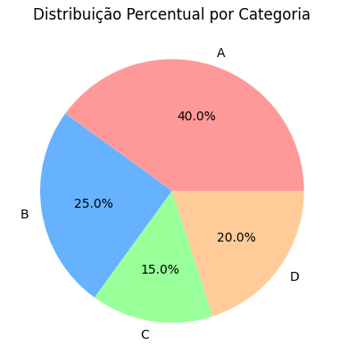
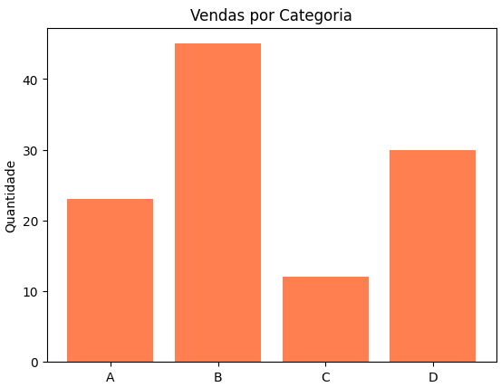
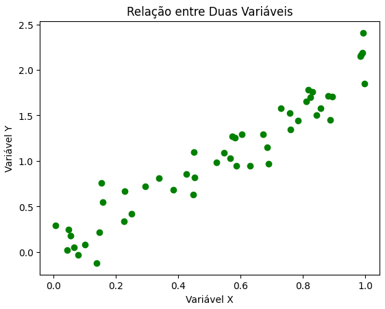
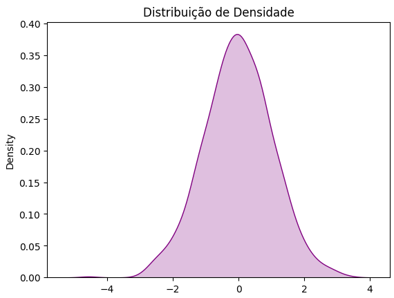
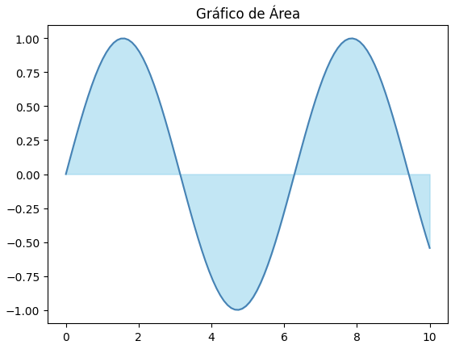
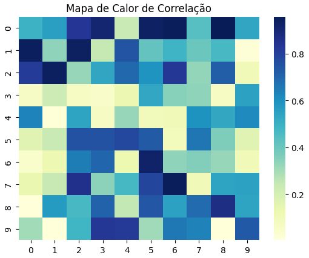
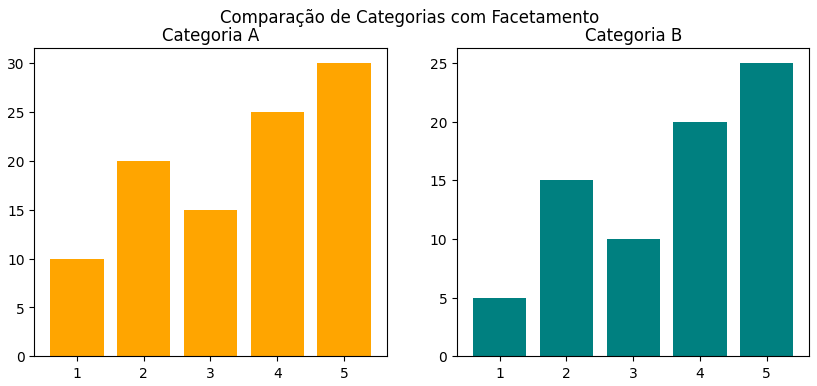
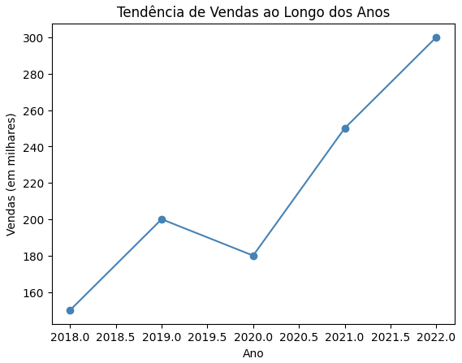

# 📌 Visualização de Dados com Matplotlib 

## 📌 Descrição

Este projeto demonstra **alguns tipos de gráficos do Matplotlib**, a biblioteca de visualização mais popular do Python.  
O objetivo é servir como um **guia prático e educativo**, com exemplos coloridos, comentados e prontos para uso em relatórios, apresentações e blogs técnicos.

Os gráficos apresentados incluem:
- Gráfico de linha de tendência  
- Facetamento (subplots)  
- Heatmap   
- Gráfico de área   
- Densidade    
- Boxplot   
- Dispersão   
- Barras  
- Pizza  

Cada gráfico possui código Python completo, paleta de cores agradável, títulos e explicação.

---

## 📌 Tecnologias Utilizadas

- **Python 3.10+**
- **Matplotlib** → Criação dos gráficos
- **Seaborn** → Estilo e paleta de cores
- **NumPy** → Geração de dados aleatórios

---

## 📌 Instalação

Clone este repositório:

```bash
git clone https://github.com/jcarlossc/matplotlib-graphics.git
cd matplotlib-graphics
```
---

## 📌Lista de gráficos










---

## 📌 Sobre
Este material foi criado para servir como introdução à visualização de dados, com exemplos simples e organizados para facilitar o aprendizado inicial.

---

## 📌 Contribuições
Se quiser contribuir:
1. Faça um fork deste repositório
2. Crie uma branch para sua feature ou correção (git checkout -b minha-feature)
3. Faça commits descritos claramente
4. Submeta um Pull Request

---

## 📌 Licença
Este projeto está licenciado sob a MIT License.

---

## 📌 Contatos
📌Autor: Carlos da Costa<br>
📌Recife, PE - Brasil<br>
📌Telefone: +55 81 99712 9140<br>
📌Telegram: @jcarlossc<br>
📌Pypi: [https://pypi.org/user/jcarlossc/](https://pypi.org/user/jcarlossc/)<br>
📌Blogger linguagem R: [https://informaticus77-r.blogspot.com/](https://informaticus77-r.blogspot.com/)<br>
📌Blogger linguagem Python: [https://informaticus77-python.blogspot.com/](https://informaticus77-python.blogspot.com/)<br>
📌Email: jcarlossc1977@gmail.com<br>
📌Portfólio em construção: https://portfolio-carlos-costa.netlify.app/<br>
📌LinkedIn: https://www.linkedin.com/in/carlos-da-costa-669252149/<br>
📌GitHub: https://github.com/jcarlossc<br>
📌Kaggle: https://www.kaggle.com/jcarlossc/  
📌Twitter/X: https://x.com/jcarlossc1977

---
